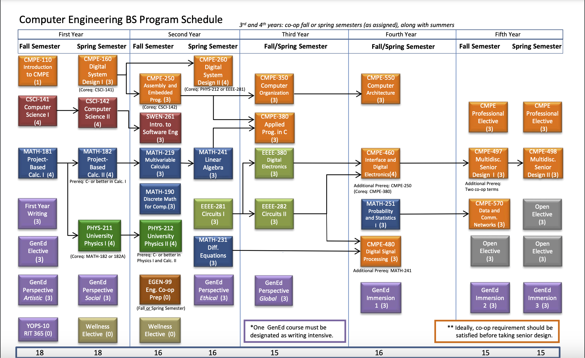

# RIT-CE-toolbox
This is a collection of useful tools created by RIT Computer Engineering students and alumni

Keep this alive! Please contribute!

## Table of contents
- [Project Directories](#project-directories)
- [Course Schedule](#course-schedule)
- [Webtools](#webtools--apps)
- [Hardware tools](#hardware-tools)
- [Com Channels](#com-channels)

# Project Directories
| Name                           | Purpose                                       | 
| :--                            | :--                                           |
|[core](/core)                   | Resources for core curriculum                 |
|[electives](/electives)         | Resources for Electives                       |
|[co-op](/co-op)                 | Resources for co-ops & jobs                   |
|[repos](/repos )                | Personal CE Repos as submodules               |
|[img](/img)                     | Images for this repo                          |

```bash
git clone https://github.com/atticusrussell/RIT-CE-toolbox.git  # Download this repo locally
git submodule update --init --remote --recursive                # Pull all the submodules too
```

# Course Schedule


# Webtools & apps
- [RIT Schedule maker](https://schedulemaker.csh.rit.edu/generate)
- [Resistor Calculator - you can save it to ur phone](https://www.calculator.net/resistor-calculator.html)
- [Fing network scanner - iPhone](https://apps.apple.com/au/app/fing-network-scanner/id430921107), [Andriod version](https://play.google.com/store/apps/details?id=com.overlook.android.fing&hl=en_US&gl=US&pli=1)
- [easyEDA Designer - online all in one PCB design and order cheap](https://easyeda.com)
- [Bluetooth serial app - iPhone](https://apps.apple.com/us/app/bluetooth-for-arduino/id1505096526)
- [Fritzing Arduino Diagram Tool (not free)](https://fritzing.org/download/)
- [VScode - openSource, does everythin', lighweight editor](https://code.visualstudio.com/download)
- [Platform IO - VScode extension for programming microcontrollers faster](https://platformio.org/)

# Hardware Tools
- [Flipper Zero](https://flipperzero.one/), a general purpose hardware tool capable of JTAG, frequency scanning, IR hacking, and much more!
- [OpenOCD](https://openocd.org/), ok ok its sofware, but it's really helpful for loading bitstreams and debugging stuff over JTAG or other protocals
- [ESP32](https://www.amazon.com/s?k=esp32+devkit), [ESP32 Tutorials](https://randomnerdtutorials.com/getting-started-with-esp32/) - Cheap and awesome arduino/platformio compatible microcontroller, code faster, learn faster
- A few LED's, suprisingly useful
- [Multimeter](https://www.amazon.com/s?k=multimeter)
- [soldering iron](https://www.amazon.com/s?k=soldering+iron)
- [Breadboard](https://www.amazon.com/s?k=breadboard)

# Com Channels
- [CE Discord](https://discord.gg/yVkhG4f2)
- [RIT makerspace](https://rit-makerspace.slack.com) - The new & cool department in the SHED, 3d print, laser cut, and get personal/class project supplies & advice cheap!
