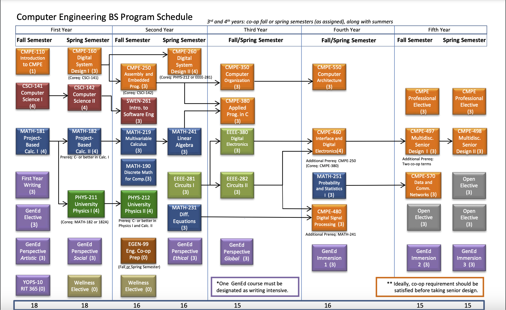

# RIT-CE-toolbox
This is a collection of useful tools created by RIT Computer Engineering students and alumni

Keep this alive! Please contribute!

## Table of contents
- [Project Directories](#project-directories)
- [Course Schedule](#course-schedule)


# Project Directories
| Name                           | Purpose                                       | 
| :--                            | :--                                           |
|[core](/core)                   | Resources for core curriculum                 |
|[electives](/electives)         | Resources for Electives                       |
|[co-op](/co-op)                 | Resources for co-ops & jobs                   |
|[repos](/repos )                | Personal CE Repos as submodules               |
|[img](/img)                     | Images for this repo                          |

```bash
git clone https://github.com/atticusrussell/RIT-CE-toolbox.git  # Download this repo locally
git submodule update --init --remote --recursive                # Pull all the submodules too
```

# Course Schedule
